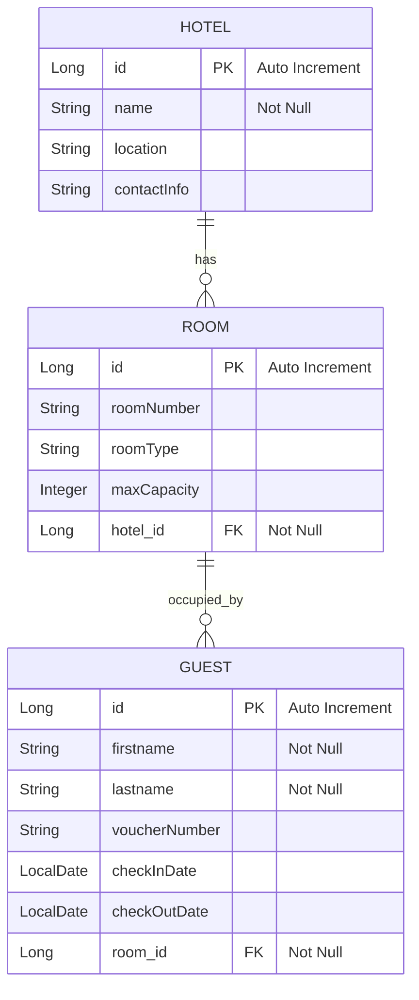

# Modern Hotel Management System

Bu proje, acentalar ve otel yöneticileri için tasarlanmış, modern ve dinamik bir Otel ve Rezervasyon Yönetim Panelidir. Karanlık tema arayüzü ve glassmorphism tasarım detayları ile kullanıcı dostu bir deneyim sunarken, güçlü arka plan mimarisi ile operasyonel veri bütünlüğünü sağlar.

## Öne Çıkan Özellikler

Otel ve Oda Yönetimi: Sisteme yeni oteller ekleme, otellere özel odalar tanımlama ve detaylı kapasite/tip (Deluxe, Suite vb.) yapılandırması.

Gelişmiş Rezervasyon Sistemi: Otomatik Voucher (Örn: VCH-XXXXX) üretimi, odaya özel misafir atama ve hızlı iptal yönetimi.

Akıllı Doluluk Takvimi: Seçili odanın rezervasyon geçmişini ve gelecek doluluk durumunu görsel takvim üzerinde izleme.

Müsaitlik Arama Paneli: Giriş-çıkış tarihleri ve kişi sayısına göre tüm sistemde veya filtrelenmiş belirli bir otelde müsait oda sorgulama.

Tam Docker Entegrasyonu: Tek komutla tüm mimariyi (Veritabanı, Backend, Frontend) bağımlılık sorunu olmadan ayağa kaldırma.

## Veritabanı ER Diyagramı ve Sistem Özellikleri

Bu bölüm, sistemin veritabanı yapısını, tablolarını, alanlarını ve hem arka plandaki (backend) REST API servislerini hem de ön yüzdeki (frontend) kullanıcı özelliklerini özetlemektedir.

Sistemimizdeki üç ana varlık arasındaki ilişkiler aşağıdaki gibidir:

* Bir Otel (Hotel) birden fazla Oda (Room) barındırabilir (1-to-Many).
* Bir Oda (Room) birden fazla Misafir (Guest) barındırabilir (1-to-Many). Rezervasyonlar oda bazlı yönetilir.

## Tablo Yapıları ve Nitelikler

A. hotels Tablosu
Otellerin genel bilgilerini tutar.

| Nitelik (Attribute) | Tip | Kısıtlamalar / Detaylar | Açıklama |
| --- | --- | --- | --- |
| id | Long | Primary Key, Auto Increment | Otelin benzersiz kimliği. |
| name | String | Not Null | Otelin adı. |
| location | String | - | Otelin konumu/adresi. |
| contactInfo | String | - | Otelin iletişim bilgileri (telefon, e-posta vb.). |

B. rooms Tablosu
Otellere bağlı odaların bilgilerini saklar.

| Nitelik (Attribute) | Tip | Kısıtlamalar / Detaylar | Açıklama |
| --- | --- | --- | --- |
| id | Long | Primary Key, Auto Increment | Odanın benzersiz kimliği. |
| roomNumber | String | - | Oda numarası (örn: 101, 202-A). |
| roomType | String | - | Oda tipi (Tek Kişilik, Çift Kişilik, Suit vb.). |
| maxCapacity | Integer | - | Odanın maksimum kişi kapasitesi. |
| hotel_id | Long | Foreign Key (Refers to hotels.id), Not Null | Odanın ait olduğu otel. |

C. guests Tablosu
Odada kalan misafirleri ve rezervasyon kayıtlarını temsil eder.

| Nitelik (Attribute) | Tip | Kısıtlamalar / Detaylar | Açıklama |
| --- | --- | --- | --- |
| id | Long | Primary Key, Auto Increment | Misafirin benzersiz kimliği. |
| firstname | String | Not Null | Misafirin adı. |
| lastname | String | Not Null | Misafirin soyadı. |
| voucherNumber | String | - | Rezervasyona ait ortak Voucher numarası (Grup rezervasyonlarını bağlar). |
| checkInDate | LocalDate | - | Giriş tarihi. |
| checkOutDate | LocalDate | - | Çıkış tarihi. |
| room_id | Long | Foreign Key (Refers to rooms.id), Not Null | Misafirin konakladığı oda. |

## Sistemin Mevcut Özellikleri

A. Arka Ofis ve Veri Yönetimi (CRUD Arayüzleri)

1. Otel Yönetimi:

* Yeni otel ekleme, güncelleme, listeleme ve silme işlemleri.

2. Oda Yönetimi:

* Belirli bir otele bağlı odaları ekleme, listeleme, güncelleme ve silme.
* Odanın maksimum kapasite ve oda tipinin belirlenmesi.

3. Misafir ve Rezervasyon Yönetimi:

* Misafir kayıtlarını oluşturma (check-in / check-out tarihleri ile).
* Soyadı ve Voucher numarasına göre dinamik sıralama ve filtreleme.
* Belirli bir oteldeki veya odadaki misafirleri listeleme.
* Tekil misafir kaydı silme.
* Voucher Numarasına Göre Toplu İptal: Bir rezervasyon altındaki tüm misafirlerin tek seferde iptal edilmesi (Toplu Silme).
* Mevcut rezervasyonların güncellenmesi.

B. Akıllı Rezervasyon ve Oda Bulma Algoritması

* Optimal Oda Arama: Giriş ve çıkış tarihleri, konaklayacak kişi sayısı ve otel kriterine göre müsait ve en uygun kapasiteye sahip odaların otomatik listelenmesi. Filtreleme yaparken çakışan rezervasyon tarihleri kontrol edilir.
* Otel Bağımsız Arama: Otel seçimi olmadan genel bir tarih ve kişi sayısına göre müsait oda listeleme.

C. Ön Yüz (Frontend) Sayfa Yapısı (Vue.js)

* HomeView (/): Karşılama ekranı ve genel durum özeti.
* HotelView ve HotelDetailView (/hotels, /hotels/:id): Otellerin listesi, detayları ve otele bağlı oda yönetim panelleri.
* RoomView ve RoomDetailView (/rooms, /rooms/:id): Oda listesi, oda detayları ve odada konaklayan aktif misafir bilgileri.
* GuestView ve GuestList (/guests): Tüm misafirlerin arama/filtreleme yapılabilen tablosu ve misafir işlemleri.
* ReservationView (/reservations): Tarih ve kişi sayısına göre oda arayıp rezervasyon kaydı oluşturma ekranı.

## Kullanılan Teknolojiler

Frontend (Kullanıcı Arayüzü):

* Vue 3 (Composition API) ve TypeScript
* Vite
* V-Calendar
* Lucide Icons
* Nginx (Docker üzerinde statik sunum)

Backend (Sunucu ve API):

* Java 21 ve Spring Boot
* Spring Data JPA ve Hibernate
* PostgreSQL

DevOps ve Altyapı:

* Docker ve Docker Compose

## Kurulum ve Çalıştırma (Docker)

Sistemi yerel ortamınızda ayağa kaldırmak için bilgisayarınızda yalnızca Docker ve Docker Compose kurulu olması yeterlidir. İlave bir Node.js veya Java SDK kurulumuna gerek yoktur.

1. Projeyi Klonlama

Terminalinizi açın ve depoyu yerel bilgisayarınıza indirin:

git clone 
cd hotel

2. Konteynerleri İnşa Etme ve Başlatma

Projenin ana dizininde (docker-compose.yml dosyasının bulunduğu konumda) aşağıdaki komutu çalıştırın. Bu komut; veritabanı, arka uç ve ön yüzü sıfırdan derleyerek başlatacaktır:

docker-compose up --build

Not: Konteynerleri terminali meşgul etmeden arka planda çalıştırmak isterseniz komutun sonuna -d bayrağını ekleyebilirsiniz: docker-compose up --build -d

3. Sisteme Erişim

Veritabanı bağlantıları sağlanıp Nginx ayağa kalktığında (log akışı tamamlandığında), tarayıcınız üzerinden aşağıdaki adreslerle sisteme erişebilirsiniz:

Kullanıcı Paneli (Frontend): http://localhost:5173
Backend API: http://localhost:8080

Sistemi Durdurma

Çalışan konteynerleri durdurmak ve oluşturulan ağı temizlemek için terminalinizde şu komutu çalıştırabilirsiniz:

docker-compose down

Geliştirici: Elif DOĞAN
